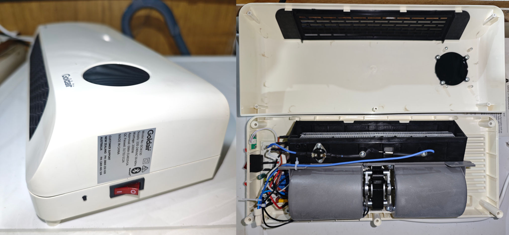
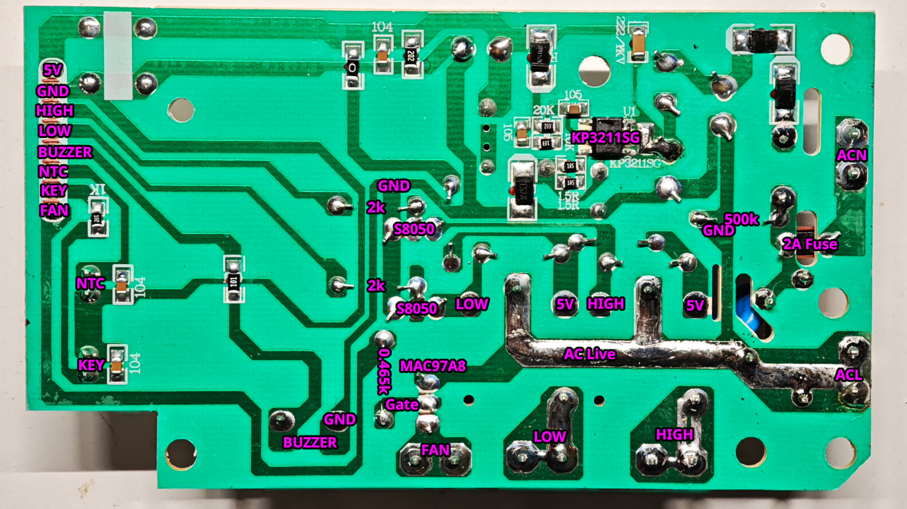
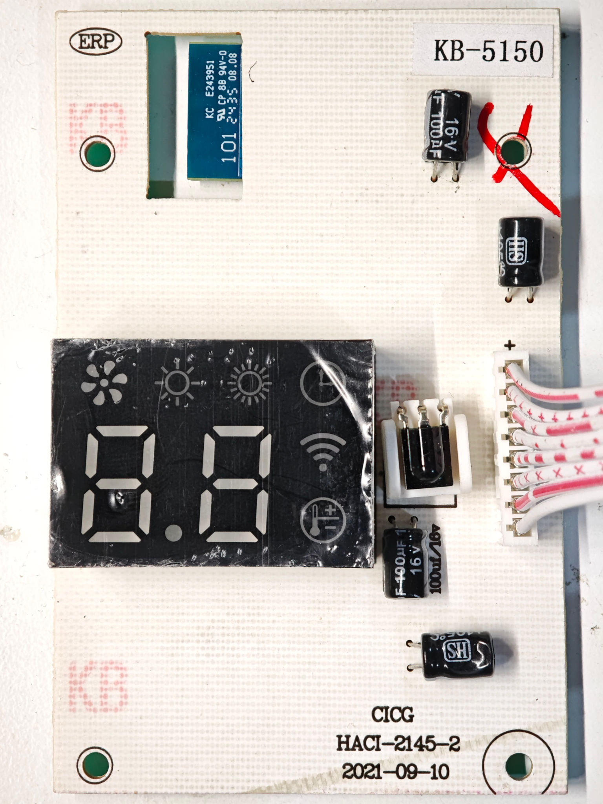
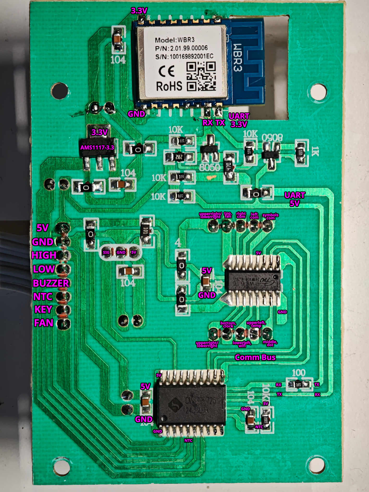

## Tuya WiFi PIR Motion Sensor

It has the [WBR3 module](https://docs.libretiny.eu/boards/wbr3/) with the Realtek RTL8720CF.

### Disassembly

The cover is easily removed with four screws.

The wifi and power PCBs are also attached with four screws.

The WBR3 module will need to removed if you want to flash it as the PA15 and PA00 pins are on the rear.

### Power Board overview

The power board is quite simple and includes a KP3211SG DC-DC converter IC for the 5V rail.
There are two relays driven by S8050 transistors for the high and low heater elements.
The heater fan is driven by a MAC97A8 4Q triac.
There is a presumably passive piezo buzzer and sockets for the NTC temp sensor and button.
The button is on it's own PCB.

Note that GND is live with 230VAC! Don't try to touch it or connect it to anything when open.

### WiFi Board overview

The WiFi board plugs into the power board with an 8 pin cable.
There is an AM1117-3.3 for the 3.3V to power the WBR3 WiFi module.
There's a 5V microcontroller interfacing with the power board and an IR receiver.
This is connected via UART to the WBR3 module.
There's another microcontroller connected to the first one that controls the display.

To use this board with ESPHome you will need to decode the serial commands between the WBR3 module and the first microcontroller.
That's likely fairly simple, but unfortunately I damaged my WiFi board beyond repair.

The other option is to create a new WiFi board.
It will just need a 3.3V regulator, some sort of 5V level translation to interface with the power board,
and optionally an LED display and driver.

This will allow finer control over the heater.

## GPIO pinout

| PIN | GPIO | Component      |
|-----|------|----------------|
| 3   | CEN  | Chip-Enable    |
| 8   | 3V3  | 3V3            |
| 9   | GND  | GND            |
| 11  | PA16 | TX2            |
|     | PA15 | RX2            |
|     | PA00 | Strapping pin  |
| 15  | PA13 | RX0            |
| 16  | PA14 | RX1            |
