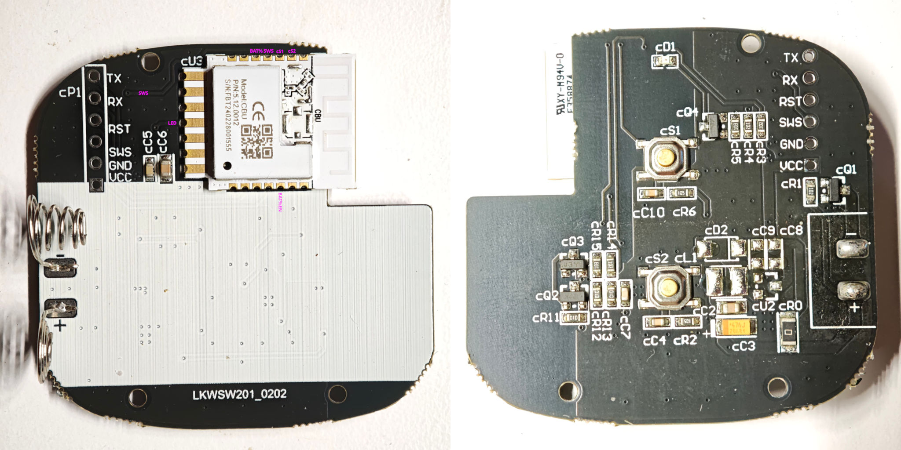

## Tuya 2 Gang WiFi Scene Switch

I believe this is from AliExpress. This is a WiFI version but they also come in Zigbee versions.
It has the [CBU module](https://docs.libretiny.eu/boards/cbu/) with the Beken BK7231N.

I'm not sure if this device supports cloudcutter - I just flashed it via UART. It might support it if not upgraded


### Disassembly

After removing the battery cover by sliding it off, use a tool to pry around the edge and loosen the clips.

You can flash directly to the board with a USB to serial adapter. Make sure your UART RX and TX lines are 3.3V.

### Board overview

The board has obviously been designed for low power usage.
The voltage divider for the battery measurement is enabled with P17 which then allows measurement with the ADC on P23.

The cS1 and cS2 inputs should not have software pullups or pulldowns enabled as that will increase power usage.

cQ1 is potentially for turning it off fully when batteries are too low.



## GPIO pinout

| PIN | GPIO | Component      |
|-----|------|----------------|
| 1   | P22  | SWS           |
| 2   | P16  | REL (PIR out)  |
| 3   | P20  | cS1 (Button 1) |
| 3   | P16  | cS2 (Button 2) |
| 5   | P23  | BAT%           |
| 14  | GND  | GND            |
| 15  | 3V3  | +V             |
| 20  | P17  | BAT% EN        |

## Basic Configuration

```yaml file=config.yaml
```
