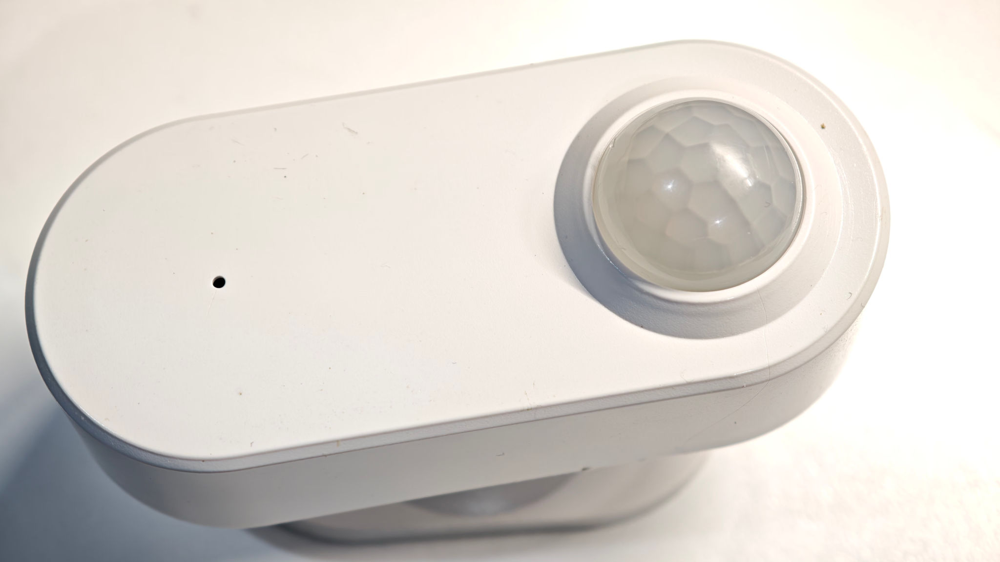
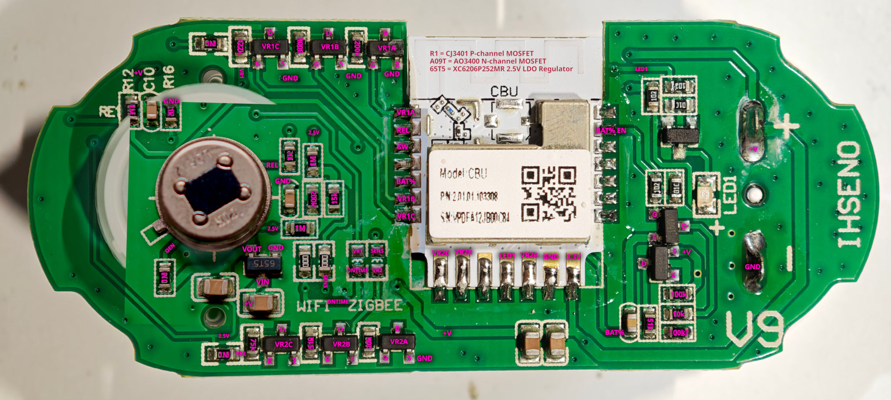
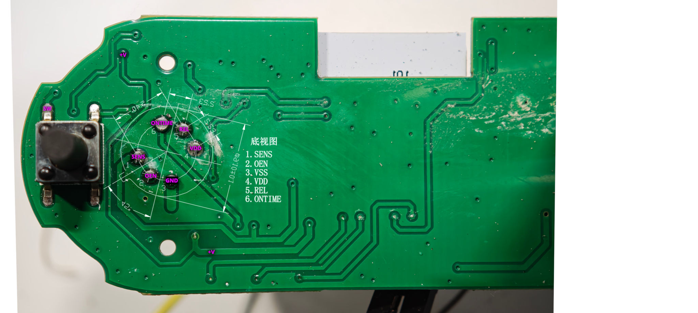

## Tuya WiFi PIR Motion Sensor

I believe this is from AliExpress. This is a WiFI version but they also come in Zigbee versions.
It has the [CBU module](https://docs.libretiny.eu/boards/cbu/) with the Beken BK7231N.

I'm not sure if this device supports cloudcutter - I just flashed it via UART. It might support it if not upgraded





### Disassembly

After removing the battery cover by sliding it off, use a tool to pry around the edge and loosen the four clips.
At the same time press gently on the PIR lense to push out the PCB.

You can flash directly to the CBU board with a USB to serial adapter.
You'll probably need to solder wires to the module but it can remain connected to the PCB.
Make sure your UART RX and TX lines are 3.3V. I only connected GND, TX and RX and used the two AAAs to power it.
Insert the last battery as you're trying to connect with ltchiptool to put it in program mode.

## GPIO pinout

| PIN | GPIO | Component      |
|-----|------|----------------|
| 1   | P14  | VR1A           |
| 2   | P16  | REL (PIR out)  |
| 3   | P20  | SW (Button)    |
| 5   | P23  | BAT%           |
| 6   | P1   | VR1B           |
| 7   | P0   | VR1C           |
| 8   | P8   | VR2C           |
| 9   | P7   | VR2B           |
| 11  | P26  | LED1           |
| 12  | P24  | VR2A           |
| 14  | GND  | GND            |
| 15  | 3V3  | +V             |
| 20  | P17  | BAT% EN        |

## Basic Configuration

```yaml file=config.yaml
```
