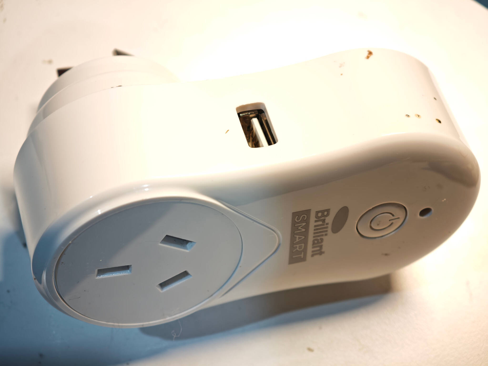
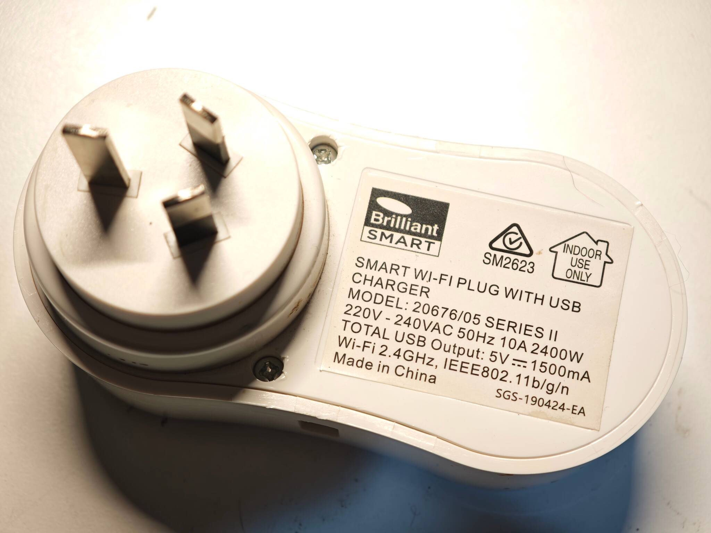
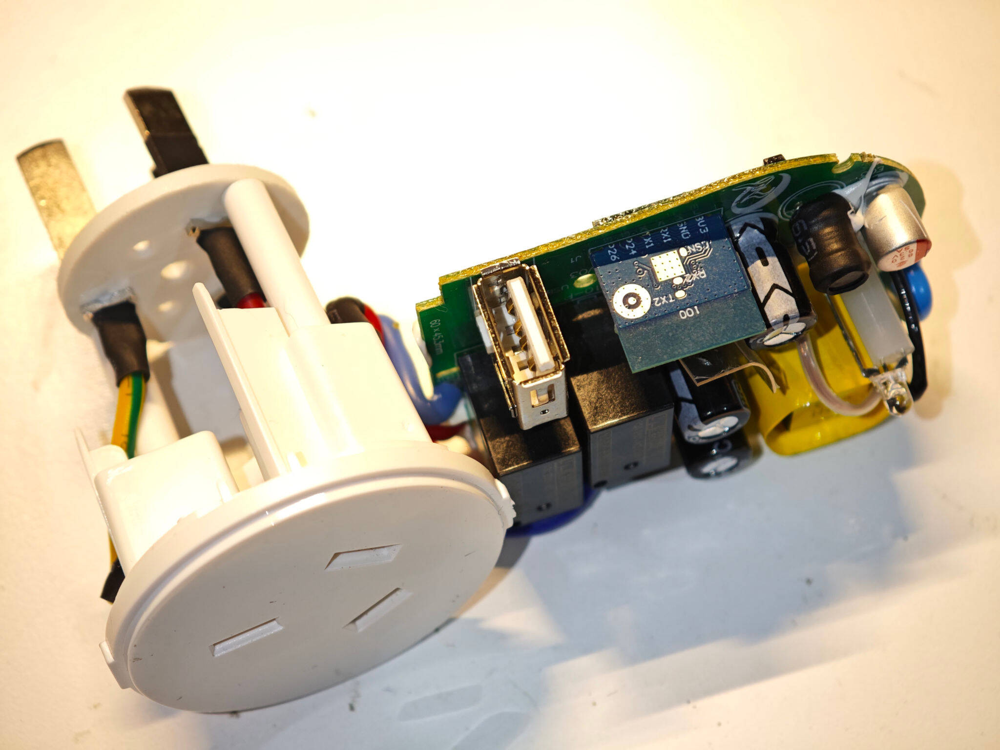
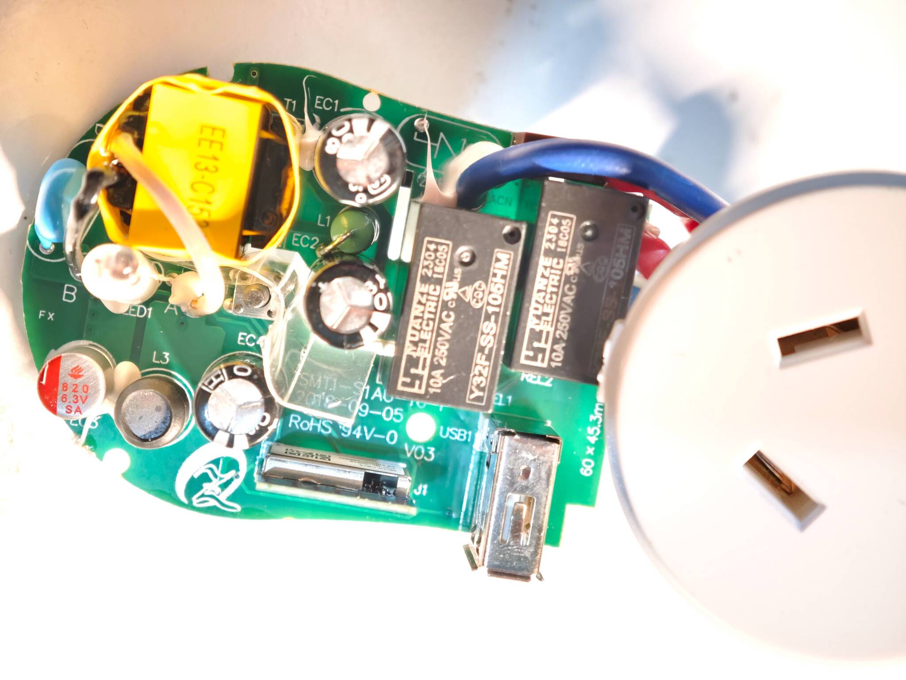
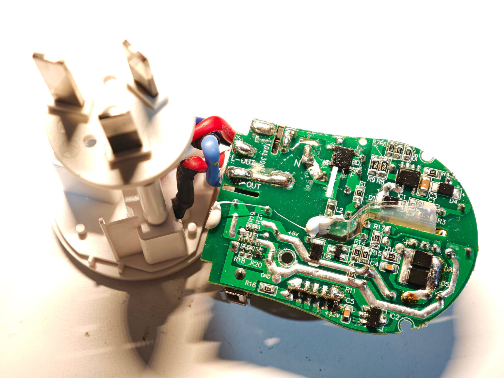
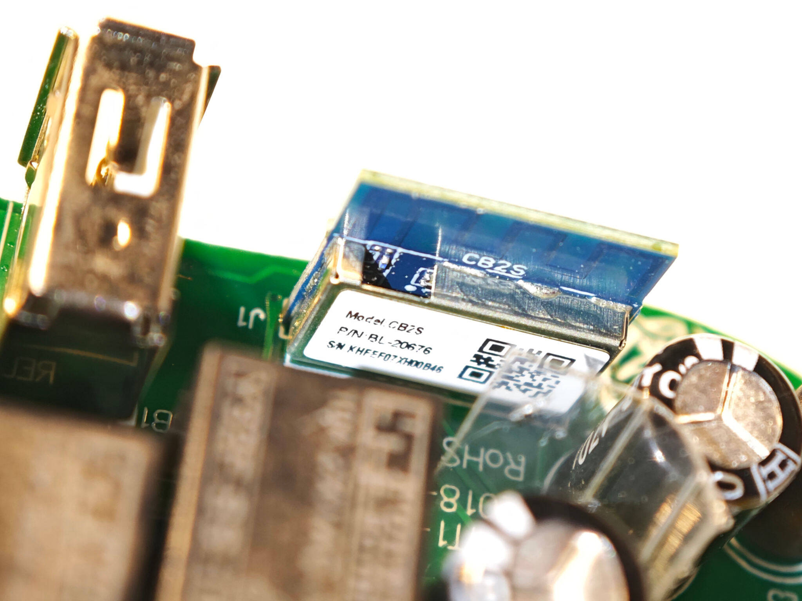

## Brilliant Smart 20676/05 Series II Smart Wi-Fi Plug with USB

Sold by Mitre 10 this is a AU/NZ standard socket.
It appears some may have esp8266 (perhaps prior to series II) but this one has the
[CB2S module](https://docs.libretiny.eu/boards/cb2s/) with the Beken BK7231N.

I'm not sure if this device supports cloudcutter - I just flashed it via UART.
It might support it if not upgraded.

This unit has a bi-colour red and blue LED. Only the blue is programmable,
the red is connected in hardware to the relay status.




### Disassembly

This unit is easy to disassemble. There are two screws hidden under small caps on the rear.
After unscrewing those,
using a guitar pick around the little gap to loosen the clips and the unit will come apart.
There are two more smaller screws holding the PCB to the remaining half of the case.

You can flash directly to the outlet with a USB to serial adapter.
You'll probably need to solder wires to the module but it can remain connected to the PCB.
You can power the board with 5V (where it's marked on the PCB or at the end of the diode markked D5)
if you want to use the relay.
In that case leave the 3.3V disconnected but make sure your UART RX and TX lines are still 3.3V.






## GPIO pinout

| PIN | GPIO #   | Component             |
|-----|----------|-----------------------|
| 2   | P6       | Relay                 |
| 11  | P26      | Button (Inverted)     |
| 9   | P24      | Blue LED (Inverted)   |
| 3   | GND      | GND                   |
| 1   | 3V3      | 3V3                   |
| 7   | TX (P11) | TX                    |
| 5   | RX (P10) | RX                    |
| 10  | CEN      | FOR FLASH             |

## Basic Configuration

```yaml file=config.yaml
```
